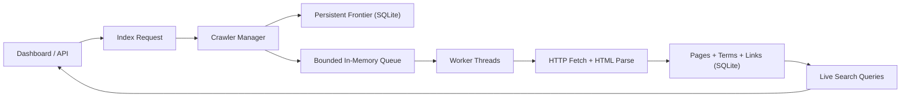

# BLG 483E HW1: Stdlib-First Web Crawler

This repository contains a single-machine web crawler and live search engine built primarily with Python standard library modules. The project was implemented for the BLG 483E Homework 1 assignment and focuses on correctness, scalability on one machine, controlled back pressure, and search visibility while indexing is still active.

The crawler exposes the two required capabilities:

- `index(origin, k)` starts a bounded crawl from an origin URL up to depth `k`
- `search(query)` returns matching URLs together with the origin URL and discovery depth

The implementation also includes a localhost dashboard for starting jobs, observing queue pressure and worker activity, and querying the live index while the crawl is running.

## Included Deliverables

- Source code for the crawler, storage layer, parser, UI, and tests
- [Product PRD](product_prd.md)
- [Production recommendations](recommendation.md)
- [LaTeX report source](homework_report.tex)
- [PDF report](blg_483e_hw1_report.pdf)
- Quiz-compatible raw storage export at `data/storage/p.data`

## Why This Design

The assignment explicitly prefers native functionality over full-featured crawler frameworks. To stay aligned with that requirement, the project uses:

- `urllib.request` for HTTP fetching
- `html.parser` for link and text extraction
- `sqlite3` in WAL mode for persistent indexing and concurrent reads during writes
- `threading` and `queue.Queue` for worker coordination and bounded in-memory flow control
- `http.server` for the local dashboard and JSON API

This keeps the core logic transparent while still supporting large crawls on a single machine.

## Architecture Overview



## Core Behavior

### Indexing

Each crawl job writes discovered URLs into a persistent frontier. A dispatcher only releases a bounded number of entries into the in-memory work queue, which acts as the primary back-pressure boundary. Workers fetch pages, normalize links, extract text, store searchable terms, and enqueue newly discovered links until the configured depth limit is reached.

Duplicate crawling is prevented globally. If multiple jobs discover the same page, only one fetch proceeds and the remaining workers reuse the stored result. This satisfies the requirement that the same page must not be crawled twice.

### Search During Active Crawls

Search runs directly against the SQLite-backed inverted index. Because pages are committed incrementally and the database uses WAL mode, new matches become visible while indexing is still active. This is the mechanism that allows `search(query)` to reflect partially completed crawl progress instead of waiting for full job completion.

### Back Pressure and Scalability

The system applies back pressure in two complementary ways:

- a bounded in-memory queue limits the amount of active work
- a rate limiter controls outbound fetch frequency

This keeps the crawler from overscheduling work or overwhelming the local machine during larger runs.

### Resume Support

Unfinished jobs remain persisted on disk. On restart, interrupted jobs can be resumed from the saved frontier instead of restarting from the origin URL. This is implemented by resetting unfinished frontier rows back to `pending` and continuing dispatch from the existing database state.

## Project Layout

```text
.
|-- crawler_app/
|   |-- http_server.py
|   |-- manager.py
|   |-- parser.py
|   |-- storage.py
|   `-- utils.py
|-- sample_site/
|-- static/
|-- tests/
|-- main.py
|-- product_prd.md
|-- recommendation.md
|-- homework_report.tex
`-- blg_483e_hw1_report.pdf
```

## Run Locally

Python 3.12 is sufficient. No third-party runtime dependencies are required.

1. Start the demo website:

```bash
python -m http.server 9001 -d sample_site
```

2. Start the crawler dashboard:

```bash
python main.py --host 127.0.0.1 --port 3600 --auto-resume
```

3. Open the UI:

```text
http://127.0.0.1:3600
```

4. Suggested demo crawl:

```text
Origin URL: http://127.0.0.1:9001/index.html
Max Depth: 2
Workers: 4
Rate Limit: 3
Queue Limit: 64
```

5. Suggested demo queries:

```text
python
relevance
concurrency
```

## API Summary

### Start Crawl

```http
POST /api/index
Content-Type: application/json

{
  "origin": "http://127.0.0.1:9001/index.html",
  "max_depth": 2,
  "worker_count": 4,
  "rate_limit": 3.0,
  "queue_limit": 64
}
```

### Search

```http
GET /api/search?q=python&limit=20
```

### Quiz-Compatible Search

```http
GET /search?query=relevance&sortBy=relevance
```

This endpoint uses the quiz scoring formula directly:

```text
score = (frequency * 10) + 1000 - (depth * 5)
```

The raw line source for those scores is exported to:

```text
data/storage/p.data
```

### System State

```http
GET /api/status
GET /api/jobs
GET /api/jobs/{job_id}
POST /api/jobs/{job_id}/resume
```

## Testing

Run the local test suite with:

```bash
python -m unittest discover -s tests -v
```

The GitHub Actions workflow in this repository runs the same test suite automatically on push.

## Notes on Assignment Interpretation

- "Never crawl the same page twice" is implemented globally across all persisted crawl state.
- "Search should run while indexing is active" is implemented with incremental page-level commits rather than end-of-job indexing.
- "Back pressure" is implemented through both queue depth limits and request rate limiting.
